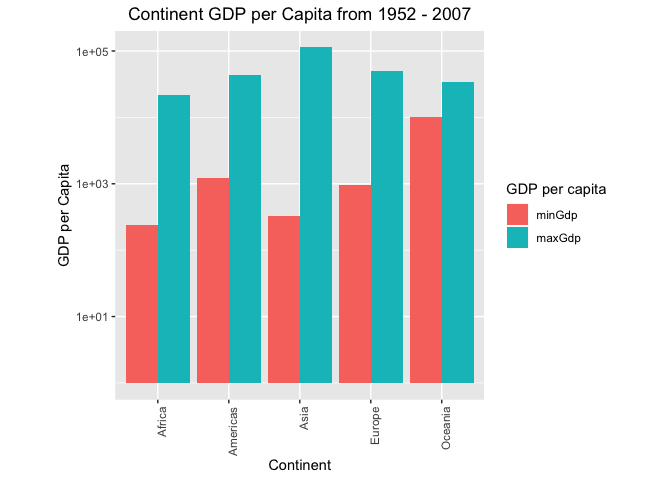
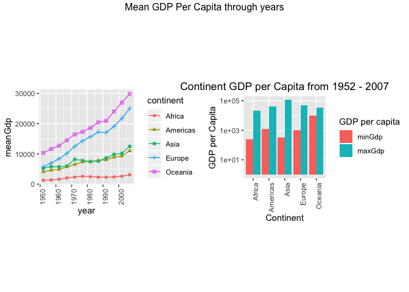
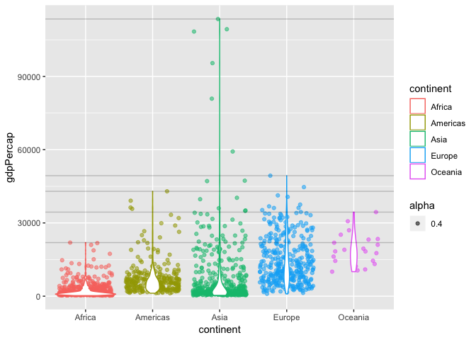
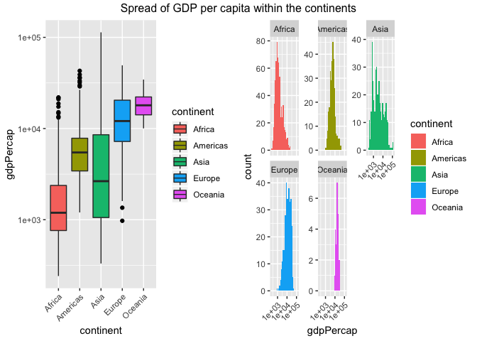
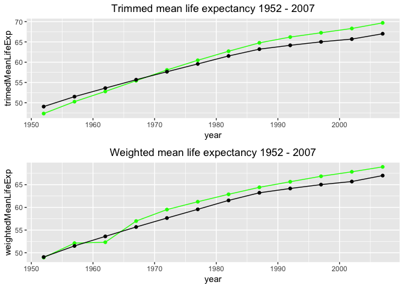
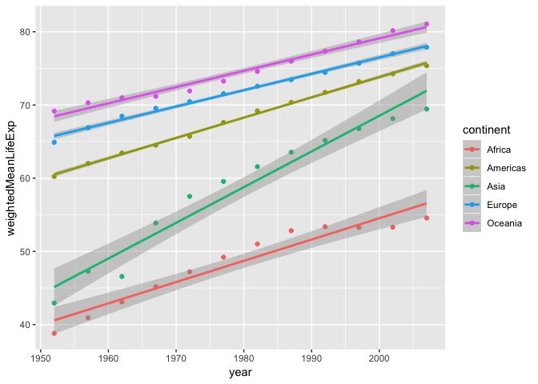
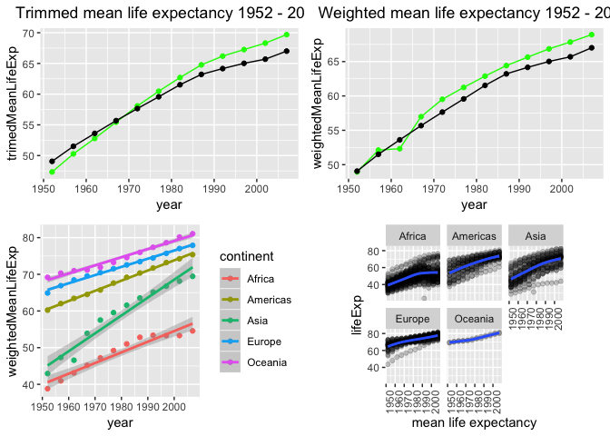

hw03\_gapminder
================
Seevasant Indran
01 October, 2018

Packages required
-----------------

-   [tidyverse](http://tidyverse.tidyverse.org/) (includes [ggplot2](http://ggplot2.tidyverse.org/), [dplyr](http://dplyr.tidyverse.org/), [tidyr](http://tidyr.tidyverse.org/), [readr](http://readr.tidyverse.org/), [purrr](http://purrr.tidyverse.org/), [tibble](http://tibble.tidyverse.org/))
    -   Install by running 'install.packages("tidyverse", dependencies = TRUE)'

Functions used
--------------

-   **%&gt;%** - Syntactic sugar for easily piping the result of one function into another.
-   **ggplot2::ggplot()** - Base function for using ggplot2. Lays out the invisible 'canvas' for graphing.
-   **ggplot2::geom\_point()** - Geom function for drawing data points in scatterplots.
-   **ggplot2::geom\_smooth()** - Geom function for drawing fitted lines in trend charts.
-   **ggplot2::geom\_bar()** - Geom function for drawing bars in bar graphs.
-   **ggplot2::geom\_density()** - Geom function for drawing density plots.
-   **ggplot2::geom\_boxplot()** - Geom function for drawing box plots.
-   **ggplot2::geom\_violin()** - Geom function for violin plots.
-   **ggplot2::facet\_wrap()** - ggplot2 function for separating factor levels into multiple graphs.
-   **ggplot2::xlab()** - Manually set x-axis label.
-   **ggplot2::ylab()** - Manually set y-axis label.
-   **ggplot2::scale\_y\_reverse()** - Reverse y-axis.
-   **ggplot2::coord\_flip()** - Flip x and y axes.
-   **ggplot2::coord\_polar()** - Use polar axes.
-   **dplyr::group\_by()** - Commonly used with summarize() to derive summarized values for multiple rows sharing certain attribues, e.g. Average fuel consumption rates of different car manufacturer.
-   **dplyr::summarize()** - Commonly used with summarize() to derive summarized values for multiple rows sharing certain attribues.
-   **reshape::melt()** - Changes a rectangular data into the long format.
-   **knitr::kable()** - Changes a rectangular data into the long format.

Initial Package Setup
---------------------

``` r
library(tidyverse)
library(gapminder)
library(reshape2)
library(knitr)
suppressPackageStartupMessages(library(kableExtra))
suppressPackageStartupMessages(library(gghighlight))
suppressPackageStartupMessages(library(gridExtra))
```

Exploration Tasks
-----------------

### (1) Get the maximum and minimum of GDP per capita for all continents

``` r
# Make a copy of the gapminder dataset
gpmd <- gapminder


maxMinGdp <- gpmd %>%
  group_by(continent) %>% # group data by continent
  summarize(minGdp = min(gdpPercap), maxGdp = max(gdpPercap)) %>% # calculate min/max continent
  melt() # changes the rectangular data into long table

kable(maxMinGdp)
```

<table>
<thead>
<tr>
<th style="text-align:left;">
continent
</th>
<th style="text-align:left;">
variable
</th>
<th style="text-align:right;">
value
</th>
</tr>
</thead>
<tbody>
<tr>
<td style="text-align:left;">
Africa
</td>
<td style="text-align:left;">
minGdp
</td>
<td style="text-align:right;">
241.1659
</td>
</tr>
<tr>
<td style="text-align:left;">
Americas
</td>
<td style="text-align:left;">
minGdp
</td>
<td style="text-align:right;">
1201.6372
</td>
</tr>
<tr>
<td style="text-align:left;">
Asia
</td>
<td style="text-align:left;">
minGdp
</td>
<td style="text-align:right;">
331.0000
</td>
</tr>
<tr>
<td style="text-align:left;">
Europe
</td>
<td style="text-align:left;">
minGdp
</td>
<td style="text-align:right;">
973.5332
</td>
</tr>
<tr>
<td style="text-align:left;">
Oceania
</td>
<td style="text-align:left;">
minGdp
</td>
<td style="text-align:right;">
10039.5956
</td>
</tr>
<tr>
<td style="text-align:left;">
Africa
</td>
<td style="text-align:left;">
maxGdp
</td>
<td style="text-align:right;">
21951.2118
</td>
</tr>
<tr>
<td style="text-align:left;">
Americas
</td>
<td style="text-align:left;">
maxGdp
</td>
<td style="text-align:right;">
42951.6531
</td>
</tr>
<tr>
<td style="text-align:left;">
Asia
</td>
<td style="text-align:left;">
maxGdp
</td>
<td style="text-align:right;">
113523.1329
</td>
</tr>
<tr>
<td style="text-align:left;">
Europe
</td>
<td style="text-align:left;">
maxGdp
</td>
<td style="text-align:right;">
49357.1902
</td>
</tr>
<tr>
<td style="text-align:left;">
Oceania
</td>
<td style="text-align:left;">
maxGdp
</td>
<td style="text-align:right;">
34435.3674
</td>
</tr>
</tbody>
</table>
#### Ploting GDP per Capita Min / Max from 1952 - 2007

``` r
# Plot GDP per Capita Min / Max from 1952 - 2007

continentGdpMinMaxPlot <- maxMinGdp %>% # assign results to "continentGdpMinMaxPlot""
  ggplot(aes(fill = variable, y = value, x = maxMinGdp$continent)) +
  geom_bar(position = "dodge", stat = "identity") + # plot "dodge", plots them side by side
  scale_y_log10() + # Y Axis on log10 scale 
  labs(fill = "GDP per capita") + # legend title "GDP per capita"
  theme(aspect.ratio = 1, axis.text.x = element_text(angle = 90, hjust = 1), # sets continents 90 degrees angle on X Axis
        plot.title = element_text(hjust = 0.5)) + # Center title, default is left aligned
  ggtitle("Continent GDP per Capita from 1952 - 2007") + # title of plot
  ylab("GDP per Capita") + # Y axis label
  xlab("Continent") # X Axis label

print(continentGdpMinMaxPlot)
```



Asia has the widest range of GDP per capita values, followed by Africa. Oceania has the smallest differences in GDP per capita in all those years. We will try to explain some of the results in the next few sections.

#### How many countries are in each continent

``` r
countrycount <- table(select(gpmd, continent)) / 
  (nrow(gpmd) / n_distinct(gpmd$country))
  

print(countrycount)
```

    ## 
    ##   Africa Americas     Asia   Europe  Oceania 
    ##       52       25       33       30        2

#### Plotting GDP per capita for each continent from 1952 - 2007

``` r
  gdpPerCapbyYear = gpmd %>%
  group_by(continent, year) %>%
  summarize(meanGdp = mean(gdpPercap))

p1 <- gdpPerCapbyYear%>%
  ggplot(aes(year, meanGdp, shape = continent, color = continent)) +
  geom_point() + 
  geom_line() + 
  theme(aspect.ratio = 1, axis.text.x = element_text(angle = 90, hjust = 1), # sets continents 90 degrees angle on X Axis
        plot.title = element_text(hjust = 0.5))
  

grid.arrange(p1, continentGdpMinMaxPlot, ncol = 2,
  top = "Mean GDP Per Capita through years",
  widths = c(0.7, 0.7),
  clip = FALSE
)
```



It can be seen here that Africa 52 has the highest number of country representation in the dataset followed by Asia 33 and Oceania has 2, the least number of representative. This partially explains why there is the least differences between Oceania and the high differences between Asian and African continent. Althogh Africa has the most representative countries, Asia had the biggest difference between GDP percapita in the dataset because it can be seen that Asia has a steady increase of mean GDP per capita over the years compared to Africa, which has a very slow non-linear growth to the GDP per capita.

To get a intuitive sense of the maximum and minimum gdpPercap for different continents, I utilize the violin plot along with the jitter plot, where I also add a horizontal line to indicate the maximum values.

``` r
summ = 
  gapminder%>%
  group_by(continent) %>%
  summarize(max.gdp = max(gdpPercap), min.gdp = min(gdpPercap))

gapminder%>%
  ggplot(aes(continent, gdpPercap, color = continent))+
  geom_jitter(aes(alpha = 0.4))+
  geom_violin()+
  geom_hline(yintercept = summ$max.gdp, alpha = 0.2)
```



### (2) Look at the spread of GDP per capita within the continents

``` r
spreadgdp  <- gpmd %>%
  group_by(continent) %>%
  summarize(
  Min = min(gdpPercap),
  Max = max(gdpPercap),
  Mean = mean(gdpPercap),
  SD = sd(gdpPercap),
  Median = median(gdpPercap),
  Q1st = quantile(gdpPercap, 1/4),
  Q3rd = quantile(gdpPercap, 3/4),
  IQR = IQR(gdpPercap),
  Var = var(gdpPercap),
  PopVar = var(gdpPercap) * ((n_distinct(gapminder$country) -
  1) / n_distinct(gapminder$country)),
  )

kable(spreadgdp)
```

<table>
<thead>
<tr>
<th style="text-align:left;">
continent
</th>
<th style="text-align:right;">
Min
</th>
<th style="text-align:right;">
Max
</th>
<th style="text-align:right;">
Mean
</th>
<th style="text-align:right;">
SD
</th>
<th style="text-align:right;">
Median
</th>
<th style="text-align:right;">
Q1st
</th>
<th style="text-align:right;">
Q3rd
</th>
<th style="text-align:right;">
IQR
</th>
<th style="text-align:right;">
Var
</th>
<th style="text-align:right;">
PopVar
</th>
</tr>
</thead>
<tbody>
<tr>
<td style="text-align:left;">
Africa
</td>
<td style="text-align:right;">
241.1659
</td>
<td style="text-align:right;">
21951.21
</td>
<td style="text-align:right;">
2193.755
</td>
<td style="text-align:right;">
2827.930
</td>
<td style="text-align:right;">
1192.138
</td>
<td style="text-align:right;">
761.247
</td>
<td style="text-align:right;">
2377.417
</td>
<td style="text-align:right;">
1616.170
</td>
<td style="text-align:right;">
7997187
</td>
<td style="text-align:right;">
7940869
</td>
</tr>
<tr>
<td style="text-align:left;">
Americas
</td>
<td style="text-align:right;">
1201.6372
</td>
<td style="text-align:right;">
42951.65
</td>
<td style="text-align:right;">
7136.110
</td>
<td style="text-align:right;">
6396.764
</td>
<td style="text-align:right;">
5465.510
</td>
<td style="text-align:right;">
3427.779
</td>
<td style="text-align:right;">
7830.210
</td>
<td style="text-align:right;">
4402.431
</td>
<td style="text-align:right;">
40918591
</td>
<td style="text-align:right;">
40630432
</td>
</tr>
<tr>
<td style="text-align:left;">
Asia
</td>
<td style="text-align:right;">
331.0000
</td>
<td style="text-align:right;">
113523.13
</td>
<td style="text-align:right;">
7902.150
</td>
<td style="text-align:right;">
14045.373
</td>
<td style="text-align:right;">
2646.787
</td>
<td style="text-align:right;">
1056.993
</td>
<td style="text-align:right;">
8549.256
</td>
<td style="text-align:right;">
7492.262
</td>
<td style="text-align:right;">
197272506
</td>
<td style="text-align:right;">
195883263
</td>
</tr>
<tr>
<td style="text-align:left;">
Europe
</td>
<td style="text-align:right;">
973.5332
</td>
<td style="text-align:right;">
49357.19
</td>
<td style="text-align:right;">
14469.476
</td>
<td style="text-align:right;">
9355.213
</td>
<td style="text-align:right;">
12081.749
</td>
<td style="text-align:right;">
7213.085
</td>
<td style="text-align:right;">
20461.386
</td>
<td style="text-align:right;">
13248.301
</td>
<td style="text-align:right;">
87520020
</td>
<td style="text-align:right;">
86903681
</td>
</tr>
<tr>
<td style="text-align:left;">
Oceania
</td>
<td style="text-align:right;">
10039.5956
</td>
<td style="text-align:right;">
34435.37
</td>
<td style="text-align:right;">
18621.609
</td>
<td style="text-align:right;">
6358.983
</td>
<td style="text-align:right;">
17983.304
</td>
<td style="text-align:right;">
14141.859
</td>
<td style="text-align:right;">
22214.117
</td>
<td style="text-align:right;">
8072.258
</td>
<td style="text-align:right;">
40436669
</td>
<td style="text-align:right;">
40151904
</td>
</tr>
</tbody>
</table>
#### Boxplot of GDP per capita by continents

``` r
p3 <- gapminder %>%
  ggplot(aes(continent, gdpPercap, fill = continent)) +
  geom_boxplot(outlier.colour = "black") +
  scale_y_log10() +
  theme(axis.text.x = element_text(angle = 45, hjust = 1))
```

``` r
p4 <- gapminder %>%
  ggplot(aes(gdpPercap, fill = continent)) +
  facet_wrap(~continent,scale = "free_y") +
  geom_histogram() + 
  scale_x_log10() +
  theme(axis.text.x = element_text(angle = 45, hjust = 1))

grid.arrange(p3, p4, ncol = 2,
  top = "Spread of GDP per capita within the continents",
  widths = c(0.5, 0.5),
  clip = FALSE
)
```

 The box plot and the distribuition plots shows that Asia indeed have the widest range between Min and Max GDP per capita due alo to its outlies which are have been higher even more than Oceania and Europe and almost as low as the African continents contribuiting to a widest spread which is displayed by its Standard deviation value `1.4045373\times 10^{4}`, sample variance `1.9727251\times 10^{8}` and population variance `1.9588326\times 10^{8}`.

### (3) Compute a trimmed/weighted mean of life expectancy for different years.

Based on the definition of Trimmed mean, for most statistical applications, 5 − 25% of the ends are discarded. The 25% trimmed mean is known as the interquartile mean. Therefore, here I choose to present the interquartile mean of the life expectancy for different years.

``` r
# summarize weighted mean and trimed mean of lifeExp

lEMeans <- gpmd %>%
arrange(year) %>%  # arrange by year
group_by(year) %>%    # group by year
summarize(
meanLifeExp = mean(lifeExp),
trimedMeanLifeExp = mean(lifeExp, trim = 1 / 4),
weightedMeanLifeExp = weighted.mean(lifeExp, pop)
) 

kable(lEMeans)
```

<table>
<thead>
<tr>
<th style="text-align:right;">
year
</th>
<th style="text-align:right;">
meanLifeExp
</th>
<th style="text-align:right;">
trimedMeanLifeExp
</th>
<th style="text-align:right;">
weightedMeanLifeExp
</th>
</tr>
</thead>
<tbody>
<tr>
<td style="text-align:right;">
1952
</td>
<td style="text-align:right;">
49.05762
</td>
<td style="text-align:right;">
47.33607
</td>
<td style="text-align:right;">
48.94424
</td>
</tr>
<tr>
<td style="text-align:right;">
1957
</td>
<td style="text-align:right;">
51.50740
</td>
<td style="text-align:right;">
50.27669
</td>
<td style="text-align:right;">
52.12189
</td>
</tr>
<tr>
<td style="text-align:right;">
1962
</td>
<td style="text-align:right;">
53.60925
</td>
<td style="text-align:right;">
52.79151
</td>
<td style="text-align:right;">
52.32438
</td>
</tr>
<tr>
<td style="text-align:right;">
1967
</td>
<td style="text-align:right;">
55.67829
</td>
<td style="text-align:right;">
55.43138
</td>
<td style="text-align:right;">
56.98431
</td>
</tr>
<tr>
<td style="text-align:right;">
1972
</td>
<td style="text-align:right;">
57.64739
</td>
<td style="text-align:right;">
58.07853
</td>
<td style="text-align:right;">
59.51478
</td>
</tr>
<tr>
<td style="text-align:right;">
1977
</td>
<td style="text-align:right;">
59.57016
</td>
<td style="text-align:right;">
60.46878
</td>
<td style="text-align:right;">
61.23726
</td>
</tr>
<tr>
<td style="text-align:right;">
1982
</td>
<td style="text-align:right;">
61.53320
</td>
<td style="text-align:right;">
62.70044
</td>
<td style="text-align:right;">
62.88176
</td>
</tr>
<tr>
<td style="text-align:right;">
1987
</td>
<td style="text-align:right;">
63.21261
</td>
<td style="text-align:right;">
64.76540
</td>
<td style="text-align:right;">
64.41635
</td>
</tr>
<tr>
<td style="text-align:right;">
1992
</td>
<td style="text-align:right;">
64.16034
</td>
<td style="text-align:right;">
66.19274
</td>
<td style="text-align:right;">
65.64590
</td>
</tr>
<tr>
<td style="text-align:right;">
1997
</td>
<td style="text-align:right;">
65.01468
</td>
<td style="text-align:right;">
67.25389
</td>
<td style="text-align:right;">
66.84934
</td>
</tr>
<tr>
<td style="text-align:right;">
2002
</td>
<td style="text-align:right;">
65.69492
</td>
<td style="text-align:right;">
68.30965
</td>
<td style="text-align:right;">
67.83904
</td>
</tr>
<tr>
<td style="text-align:right;">
2007
</td>
<td style="text-align:right;">
67.00742
</td>
<td style="text-align:right;">
69.68886
</td>
<td style="text-align:right;">
68.91909
</td>
</tr>
</tbody>
</table>
``` r
p1<-lEMeans %>% 
  ggplot(aes(x=year, y=trimedMeanLifeExp, weightedMeanLifeExp)) +
  geom_point(color = "green") +
  geom_line(color = "green") +
  geom_point(aes(year,meanLifeExp)) + 
  geom_line(aes(year,meanLifeExp)) +
  ggtitle("Trimmed mean life expectancy 1952 - 2007") +
  theme(plot.title = element_text(hjust = 0.5))


p2<-lEMeans %>% 
  ggplot(aes(x=year, y=weightedMeanLifeExp)) + 
  geom_point(color = "green") +
  geom_line(color = "green") +
  geom_point(aes(year,meanLifeExp)) + 
  geom_line(aes(year,meanLifeExp)) +
  ggtitle("Weighted mean life expectancy 1952 - 2007") +
  theme(plot.title = element_text(hjust = 0.5))


grid.arrange(p1, p2, ncol = 1)
```



We could see the weighted mean (green) life expectancy dropped in 1962, this would have been there should have been a significant increase in world population for the mean to drop significantly. To explain what happened in 1962 we could refer to [this](https://ourworldindata.org/world-population-growth) article which explains that before 1800 the world population growth rate was well below 1%. The higest recorded population annual growth was recorded in 1962, and ever since it has gone down, we currently sit at around 1% annual population growth rate as of 2018.

The problem here, I would definately think that the weighted mean is more usefull as a general evaluation than the trimmed mean for me, as the question of "how much trim required" is a justification that I am not in an adequate position to make as I do have the background knowledge of population statstic or historical background that could shed some light on a reasonable gate setting for these trims.

##### Lets look at the range of life expectancies in these continents

``` r
gpmd %>%
  group_by(continent) %>% 
  summarize(range = max(lifeExp) - min(lifeExp)) %>% 
  kable()
```

<table>
<thead>
<tr>
<th style="text-align:left;">
continent
</th>
<th style="text-align:right;">
range
</th>
</tr>
</thead>
<tbody>
<tr>
<td style="text-align:left;">
Africa
</td>
<td style="text-align:right;">
52.843
</td>
</tr>
<tr>
<td style="text-align:left;">
Americas
</td>
<td style="text-align:right;">
43.074
</td>
</tr>
<tr>
<td style="text-align:left;">
Asia
</td>
<td style="text-align:right;">
53.802
</td>
</tr>
<tr>
<td style="text-align:left;">
Europe
</td>
<td style="text-align:right;">
38.172
</td>
</tr>
<tr>
<td style="text-align:left;">
Oceania
</td>
<td style="text-align:right;">
12.115
</td>
</tr>
</tbody>
</table>
As can be seen there is 40 years difference between the life Expectancies in Oceania and Africa and setting a 25% trim of the outliers for these population can seem ill justified (over-trimming) when proper historical facts or knowledege is not supported, as such It was the hardest part for me in the assignment figuring out what is the most approprite value for a trimmed mean, how far out of the data should be considered outliers..

### (4) How is life expectancy changing over time on different continents?

``` r
lExOverT = gpmd %>%
  group_by(continent, year) %>%
  summarise(weightedMeanLifeExp = weighted.mean(lifeExp, pop))

kable(lExOverT)
```

<table>
<thead>
<tr>
<th style="text-align:left;">
continent
</th>
<th style="text-align:right;">
year
</th>
<th style="text-align:right;">
weightedMeanLifeExp
</th>
</tr>
</thead>
<tbody>
<tr>
<td style="text-align:left;">
Africa
</td>
<td style="text-align:right;">
1952
</td>
<td style="text-align:right;">
38.79973
</td>
</tr>
<tr>
<td style="text-align:left;">
Africa
</td>
<td style="text-align:right;">
1957
</td>
<td style="text-align:right;">
40.94031
</td>
</tr>
<tr>
<td style="text-align:left;">
Africa
</td>
<td style="text-align:right;">
1962
</td>
<td style="text-align:right;">
43.09925
</td>
</tr>
<tr>
<td style="text-align:left;">
Africa
</td>
<td style="text-align:right;">
1967
</td>
<td style="text-align:right;">
45.17721
</td>
</tr>
<tr>
<td style="text-align:left;">
Africa
</td>
<td style="text-align:right;">
1972
</td>
<td style="text-align:right;">
47.21229
</td>
</tr>
<tr>
<td style="text-align:left;">
Africa
</td>
<td style="text-align:right;">
1977
</td>
<td style="text-align:right;">
49.20883
</td>
</tr>
<tr>
<td style="text-align:left;">
Africa
</td>
<td style="text-align:right;">
1982
</td>
<td style="text-align:right;">
51.01744
</td>
</tr>
<tr>
<td style="text-align:left;">
Africa
</td>
<td style="text-align:right;">
1987
</td>
<td style="text-align:right;">
52.82479
</td>
</tr>
<tr>
<td style="text-align:left;">
Africa
</td>
<td style="text-align:right;">
1992
</td>
<td style="text-align:right;">
53.37292
</td>
</tr>
<tr>
<td style="text-align:left;">
Africa
</td>
<td style="text-align:right;">
1997
</td>
<td style="text-align:right;">
53.28327
</td>
</tr>
<tr>
<td style="text-align:left;">
Africa
</td>
<td style="text-align:right;">
2002
</td>
<td style="text-align:right;">
53.30314
</td>
</tr>
<tr>
<td style="text-align:left;">
Africa
</td>
<td style="text-align:right;">
2007
</td>
<td style="text-align:right;">
54.56441
</td>
</tr>
<tr>
<td style="text-align:left;">
Americas
</td>
<td style="text-align:right;">
1952
</td>
<td style="text-align:right;">
60.23599
</td>
</tr>
<tr>
<td style="text-align:left;">
Americas
</td>
<td style="text-align:right;">
1957
</td>
<td style="text-align:right;">
62.01806
</td>
</tr>
<tr>
<td style="text-align:left;">
Americas
</td>
<td style="text-align:right;">
1962
</td>
<td style="text-align:right;">
63.43706
</td>
</tr>
<tr>
<td style="text-align:left;">
Americas
</td>
<td style="text-align:right;">
1967
</td>
<td style="text-align:right;">
64.50630
</td>
</tr>
<tr>
<td style="text-align:left;">
Americas
</td>
<td style="text-align:right;">
1972
</td>
<td style="text-align:right;">
65.70490
</td>
</tr>
<tr>
<td style="text-align:left;">
Americas
</td>
<td style="text-align:right;">
1977
</td>
<td style="text-align:right;">
67.60591
</td>
</tr>
<tr>
<td style="text-align:left;">
Americas
</td>
<td style="text-align:right;">
1982
</td>
<td style="text-align:right;">
69.19264
</td>
</tr>
<tr>
<td style="text-align:left;">
Americas
</td>
<td style="text-align:right;">
1987
</td>
<td style="text-align:right;">
70.35814
</td>
</tr>
<tr>
<td style="text-align:left;">
Americas
</td>
<td style="text-align:right;">
1992
</td>
<td style="text-align:right;">
71.72177
</td>
</tr>
<tr>
<td style="text-align:left;">
Americas
</td>
<td style="text-align:right;">
1997
</td>
<td style="text-align:right;">
73.19154
</td>
</tr>
<tr>
<td style="text-align:left;">
Americas
</td>
<td style="text-align:right;">
2002
</td>
<td style="text-align:right;">
74.24736
</td>
</tr>
<tr>
<td style="text-align:left;">
Americas
</td>
<td style="text-align:right;">
2007
</td>
<td style="text-align:right;">
75.35668
</td>
</tr>
<tr>
<td style="text-align:left;">
Asia
</td>
<td style="text-align:right;">
1952
</td>
<td style="text-align:right;">
42.94114
</td>
</tr>
<tr>
<td style="text-align:left;">
Asia
</td>
<td style="text-align:right;">
1957
</td>
<td style="text-align:right;">
47.28835
</td>
</tr>
<tr>
<td style="text-align:left;">
Asia
</td>
<td style="text-align:right;">
1962
</td>
<td style="text-align:right;">
46.57369
</td>
</tr>
<tr>
<td style="text-align:left;">
Asia
</td>
<td style="text-align:right;">
1967
</td>
<td style="text-align:right;">
53.88261
</td>
</tr>
<tr>
<td style="text-align:left;">
Asia
</td>
<td style="text-align:right;">
1972
</td>
<td style="text-align:right;">
57.52159
</td>
</tr>
<tr>
<td style="text-align:left;">
Asia
</td>
<td style="text-align:right;">
1977
</td>
<td style="text-align:right;">
59.55648
</td>
</tr>
<tr>
<td style="text-align:left;">
Asia
</td>
<td style="text-align:right;">
1982
</td>
<td style="text-align:right;">
61.57472
</td>
</tr>
<tr>
<td style="text-align:left;">
Asia
</td>
<td style="text-align:right;">
1987
</td>
<td style="text-align:right;">
63.53710
</td>
</tr>
<tr>
<td style="text-align:left;">
Asia
</td>
<td style="text-align:right;">
1992
</td>
<td style="text-align:right;">
65.14874
</td>
</tr>
<tr>
<td style="text-align:left;">
Asia
</td>
<td style="text-align:right;">
1997
</td>
<td style="text-align:right;">
66.77092
</td>
</tr>
<tr>
<td style="text-align:left;">
Asia
</td>
<td style="text-align:right;">
2002
</td>
<td style="text-align:right;">
68.13732
</td>
</tr>
<tr>
<td style="text-align:left;">
Asia
</td>
<td style="text-align:right;">
2007
</td>
<td style="text-align:right;">
69.44386
</td>
</tr>
<tr>
<td style="text-align:left;">
Europe
</td>
<td style="text-align:right;">
1952
</td>
<td style="text-align:right;">
64.90540
</td>
</tr>
<tr>
<td style="text-align:left;">
Europe
</td>
<td style="text-align:right;">
1957
</td>
<td style="text-align:right;">
66.89364
</td>
</tr>
<tr>
<td style="text-align:left;">
Europe
</td>
<td style="text-align:right;">
1962
</td>
<td style="text-align:right;">
68.45957
</td>
</tr>
<tr>
<td style="text-align:left;">
Europe
</td>
<td style="text-align:right;">
1967
</td>
<td style="text-align:right;">
69.54963
</td>
</tr>
<tr>
<td style="text-align:left;">
Europe
</td>
<td style="text-align:right;">
1972
</td>
<td style="text-align:right;">
70.46884
</td>
</tr>
<tr>
<td style="text-align:left;">
Europe
</td>
<td style="text-align:right;">
1977
</td>
<td style="text-align:right;">
71.53989
</td>
</tr>
<tr>
<td style="text-align:left;">
Europe
</td>
<td style="text-align:right;">
1982
</td>
<td style="text-align:right;">
72.56247
</td>
</tr>
<tr>
<td style="text-align:left;">
Europe
</td>
<td style="text-align:right;">
1987
</td>
<td style="text-align:right;">
73.44717
</td>
</tr>
<tr>
<td style="text-align:left;">
Europe
</td>
<td style="text-align:right;">
1992
</td>
<td style="text-align:right;">
74.44273
</td>
</tr>
<tr>
<td style="text-align:left;">
Europe
</td>
<td style="text-align:right;">
1997
</td>
<td style="text-align:right;">
75.70849
</td>
</tr>
<tr>
<td style="text-align:left;">
Europe
</td>
<td style="text-align:right;">
2002
</td>
<td style="text-align:right;">
77.02232
</td>
</tr>
<tr>
<td style="text-align:left;">
Europe
</td>
<td style="text-align:right;">
2007
</td>
<td style="text-align:right;">
77.89057
</td>
</tr>
<tr>
<td style="text-align:left;">
Oceania
</td>
<td style="text-align:right;">
1952
</td>
<td style="text-align:right;">
69.17040
</td>
</tr>
<tr>
<td style="text-align:left;">
Oceania
</td>
<td style="text-align:right;">
1957
</td>
<td style="text-align:right;">
70.31693
</td>
</tr>
<tr>
<td style="text-align:left;">
Oceania
</td>
<td style="text-align:right;">
1962
</td>
<td style="text-align:right;">
70.98808
</td>
</tr>
<tr>
<td style="text-align:left;">
Oceania
</td>
<td style="text-align:right;">
1967
</td>
<td style="text-align:right;">
71.17848
</td>
</tr>
<tr>
<td style="text-align:left;">
Oceania
</td>
<td style="text-align:right;">
1972
</td>
<td style="text-align:right;">
71.92273
</td>
</tr>
<tr>
<td style="text-align:left;">
Oceania
</td>
<td style="text-align:right;">
1977
</td>
<td style="text-align:right;">
73.25684
</td>
</tr>
<tr>
<td style="text-align:left;">
Oceania
</td>
<td style="text-align:right;">
1982
</td>
<td style="text-align:right;">
74.58291
</td>
</tr>
<tr>
<td style="text-align:left;">
Oceania
</td>
<td style="text-align:right;">
1987
</td>
<td style="text-align:right;">
75.98107
</td>
</tr>
<tr>
<td style="text-align:left;">
Oceania
</td>
<td style="text-align:right;">
1992
</td>
<td style="text-align:right;">
77.35788
</td>
</tr>
<tr>
<td style="text-align:left;">
Oceania
</td>
<td style="text-align:right;">
1997
</td>
<td style="text-align:right;">
78.61843
</td>
</tr>
<tr>
<td style="text-align:left;">
Oceania
</td>
<td style="text-align:right;">
2002
</td>
<td style="text-align:right;">
80.16006
</td>
</tr>
<tr>
<td style="text-align:left;">
Oceania
</td>
<td style="text-align:right;">
2007
</td>
<td style="text-align:right;">
81.06215
</td>
</tr>
</tbody>
</table>
To depict how the mean life expectancy change over time, I plot the point along with a linear regression function to capture the trend.

``` r
p3 <- lExOverT %>%
  ggplot(aes(year, weightedMeanLifeExp, color = continent)) +
  geom_point() + geom_smooth(method = "lm")

print(p3)
```



``` r
# grid.arrange(p3, p4, nrow = 1)
```

``` r
# plot the distribution of each continent.
p4 <- ggplot(gapminder, aes(year, lifeExp)) +
  facet_wrap( ~ continent) + geom_point(alpha = 0.2) + geom_smooth() +
  theme(aspect.ratio = 1, axis.text.x = element_text(angle = 90, hjust = 1)) +
  xlab("mean life expectancy")


grid.arrange(p1, p2, p3, p4, ncol = 2)
```


