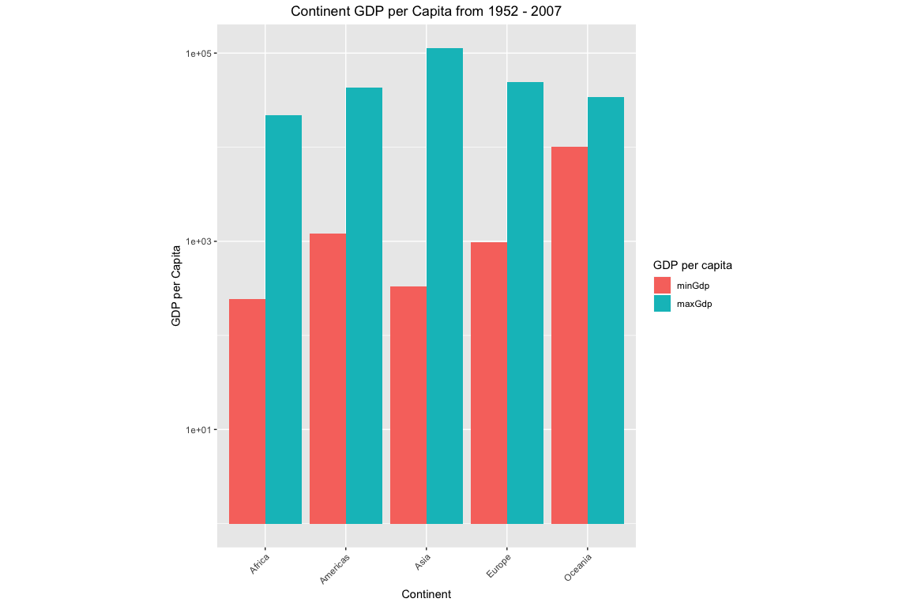
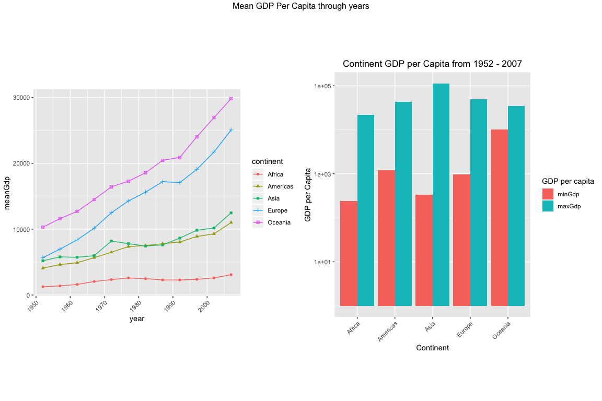
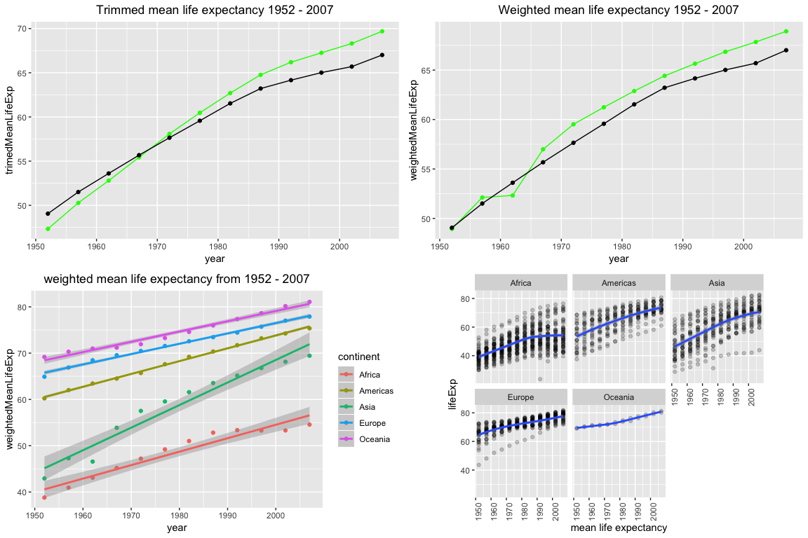

Packages required
-----------------

-   [tidyverse](http://tidyverse.tidyverse.org/) (includes [ggplot2](http://ggplot2.tidyverse.org/), [dplyr](http://dplyr.tidyverse.org/), [tidyr](http://tidyr.tidyverse.org/), [readr](http://readr.tidyverse.org/), [maps](https://cran.r-project.org/web/packages/maps/index.html), [tibble](http://tibble.tidyverse.org/))
    -   Install by running 'install.packages("tidyverse", dependencies = TRUE)'

Functions used
--------------

-   **%&gt;%** - Syntactic sugar for easily piping the result of one function into another.
-   **ggplot2::ggplot()** - Base function for using ggplot2. Lays out the invisible 'canvas' for graphing.
-   **ggplot2::geom\_point()** - Geom function for drawing data points in scatterplots.
-   **ggplot2::geom\_bar()** - Geom function for drawing bars in bar graphs.
-   **ggplot2::geom\_boxplot()** - Geom function for drawing box plots.
-   **ggplo2::geom\_map()** - Geom function for polygons from a reference map
-   **ggplot2::facet\_wrap()** - ggplot2 function for separating factor levels into multiple graphs.
-   **ggplot2::xlab()** - Manually set x-axis label.
-   **ggplot2::ylab()** - Manually set y-axis label.
-   **dplyr::group\_by()** - Commonly used with summarize() to derive summarized values for multiple rows sharing certain attribues, e.g. Average fuel consumption rates of different car manufacturer.
-   **dplyr::summarize()** - Commonly used with summarize() to derive summarized values for multiple rows sharing certain attribues.
-   **reshape::melt()** - Changes a rectangular data into the long format.
-   **knitr::kable()** - Changes a rectangular data into the long format.


### Install, load packages and assign dataset


```r
if (ev_False) {
  install.packages("tidyverse")
  install.packages("gapminder")
  install.packages("reshape2")
  install.packages("knitr")
  install.packages("maps")
}

if (ev_True) {
  library(tidyverse)
  library(gapminder)
  library(reshape2)
  library(knitr)
  library(maps)
  library(gridExtra)
}
```

## Exploration Tasks

### (1) Get the maximum and minimum of GDP per capita for all continents


```r
gpmd <- gapminder # Assigns the dataset to the variable gpmder. It is good practice to explore and not on the raw data itself in case something goes bad it can be easily fixed.

#Calculate max and min gdp and create a new column in a new dataframe (df)

maxMinGdp <- gpmd %>%
  group_by(continent) %>% # group data by continent for summarize
  summarize(minGdp = min(gdpPercap), maxGdp = max(gdpPercap)) %>% # calculate min/max gdp and creates a new column with calculated values of minGdp, maxGdp 
  melt() # changes the rectangular data frame into long table format makes it easier to work with on ggplot

kable(maxMinGdp) # Visualization aid for better looking table
```


continent   variable          value
----------  ---------  ------------
Africa      minGdp         241.1659
Americas    minGdp        1201.6372
Asia        minGdp         331.0000
Europe      minGdp         973.5332
Oceania     minGdp       10039.5956
Africa      maxGdp       21951.2118
Americas    maxGdp       42951.6531
Asia        maxGdp      113523.1329
Europe      maxGdp       49357.1902
Oceania     maxGdp       34435.3674


#### Ploting GDP per Capita Min / Max from 1952 - 2007


```r
# Plot GDP per Capita Min / Max from 1952 - 2007

continentGdpMinMaxPlot <- maxMinGdp %>% # assign results to "continentGdpMinMaxPlot""
  ggplot(aes(fill = variable, y = value, x = maxMinGdp$continent)) + #(aes) fills = min/max,GDP value on y and continent on x
  geom_bar(position = "dodge", stat = "identity") + # plot "dodge", plots them side by side
  scale_y_log10() + # Y Axis on log10 scale
  labs(fill = "GDP per capita") + # legend title "GDP per capita"
  theme(
    axis.text.x = element_text(angle = 45, hjust = 1), # sets continents 90 degrees angle on X Axis
    aspect.ratio = 10/8,
    plot.title = element_text(hjust = 0.5)
  ) + # Center title, default is left aligned
  ggtitle("Continent GDP per Capita from 1952 - 2007") + # main title of plot
  ylab("GDP per Capita") + # y axis label
  xlab("Continent") # x Axis label

print(continentGdpMinMaxPlot) # prints plot, when assign is used it doesnt automatically outputs them
```

<!-- -->

Asia has the widest range of GDP per capita values, followed by Africa. Oceania has the smallest differences in GDP per capita in all those years. We will try to explain some of the results in the next few sections.

#### How many countries are in each continent 


```r
# calculate how many countries in each continent

countrycount <- table(select(gpmd, continent)) / # selects continent data from dataset and tabulates total rows
  (nrow(gpmd) / n_distinct(gpmd$country)) # total row number / n_distinct (counts how many countries ignoring repeats), to show how many times each country is represented which is 12


print(countrycount) 
```

```
## 
##   Africa Americas     Asia   Europe  Oceania 
##       52       25       33       30        2
```

This table is made to explore more on the diferences on the min/max GDP of the countries below

#### Plotting GDP per capita for each continent from 1952 - 2007


```r
# Plotting GDP per capita for each continent from 1952 - 2007

gdpPerCapbyYear <- gpmd %>% # assignes results in "gdpPerCapbyYear"
  group_by(continent, year) %>% # group by continent and year
  summarize(meanGdp = mean(gdpPercap)) # summarize the mean gdppercap and input in new column "meanGdp"


# plot mean Gdp throught years 

p1 <- gdpPerCapbyYear %>%
  ggplot(aes(year, meanGdp, shape = continent, color = continent)) +
  geom_point() +
  geom_line() +
  theme(
    axis.text.x = element_text(angle = 45, hjust = 1), # angles the x axis labels by 45 degrees and set on ticks
    aspect.ratio = 1,
    plot.title = element_text(hjust = 0.5) # This is to center plot title in the center but, I am not using a plot title here because I am combining them later.
  )

grid.arrange(p1, continentGdpMinMaxPlot, # makes a grid of plots so multiple plots can be dislpayed
  ncol = 2, # a plot in a 2 column 1 row format 
  top = "Mean GDP Per Capita through years", # tittle for the grid plots
  widths = c(0.7, 0.7), # width for the plots
  clip = FALSE
)
```

<!-- -->

It can be seen here that Africa 52 has the highest number of country representation in the dataset followed by Asia 33 and Oceania has 2, the least number of representative. This partially explains why there is the least differences between Oceania and the high differences between the Asian and African continent. Althogh Africa has the most representative countries, Asia had the biggest difference between GDP per capita in the dataset because Asia has has a steady increase of mean GDP per capita over the years compared to Africa (slow non-linear growth to its GDP per capita).


### (2) Look at the spread of GDP per capita within the continents


```r
spreadgdp <- gpmd %>%
  group_by(continent) %>% #group dataset by continent
  summarize( # sumarise a function, creates new column assigned for each values. All calculated values below are for GDP per capita
    Min = min(gdpPercap), # min
    Max = max(gdpPercap), # max
    Mean = mean(gdpPercap), # mean
    SD = sd(gdpPercap), # SD
    Median = median(gdpPercap), # median
    Q1st = quantile(gdpPercap, 1 / 4), # 1st quartile (0.25)
    Q3rd = quantile(gdpPercap, 3 / 4), # 3rd quatile (0.75)
    IQR = IQR(gdpPercap), # interquatile range
    Var = var(gdpPercap), # sample variace
    PopVar = var(gdpPercap) * ((n_distinct(gapminder$country) -
      1) / n_distinct(gapminder$country)), # population variance. pop var = variance * 141/142(total countries represented)
  )

kable(spreadgdp) # kable makes printing table output look nicer.
```


continent           Min         Max        Mean          SD      Median        Q1st        Q3rd         IQR         Var      PopVar
----------  -----------  ----------  ----------  ----------  ----------  ----------  ----------  ----------  ----------  ----------
Africa         241.1659    21951.21    2193.755    2827.930    1192.138     761.247    2377.417    1616.170     7997187     7940869
Americas      1201.6372    42951.65    7136.110    6396.764    5465.510    3427.779    7830.210    4402.431    40918591    40630432
Asia           331.0000   113523.13    7902.150   14045.373    2646.787    1056.993    8549.256    7492.262   197272506   195883263
Europe         973.5332    49357.19   14469.476    9355.213   12081.749    7213.085   20461.386   13248.301    87520020    86903681
Oceania      10039.5956    34435.37   18621.609    6358.983   17983.304   14141.859   22214.117    8072.258    40436669    40151904

#### Boxplot of GDP per capita by continents


```r
# Boxplot of GDP per capita by continents

p3 <- gapminder %>% # assign plots for gridding function below
  ggplot(aes(continent, gdpPercap, fill = continent)) +
  geom_boxplot(outlier.colour = "black") +
  scale_y_log10() + # scales the y axis to log 10
  theme(axis.text.x = element_text(angle = 45, hjust = 1))
```


```r
p4 <- gapminder %>% # assign plots for gridding function below
  ggplot(aes(gdpPercap, fill = continent)) +
  facet_wrap(~continent, scale = "free_y") +
  geom_histogram() +
  scale_x_log10() + # scales the x axis to log 10
  theme(axis.text.x = element_text(angle = 45, hjust = 1))

grid.arrange(p3, p4, # grids of for p3 and p4
  ncol = 2,
  top = "Spread of GDP per capita within the continents", # title of gridplots
  widths = c(0.5, 0.5), # width of gridplots
  clip = FALSE
)
```

<!-- -->

The box plot and the distribuition plots shows that Asia indeed have the widest range between Min and Max GDP per capita due to its outlies. Asia has outliers that are even higher than Oceania and Europe and outliers which are almost as low as the African continents contribuiting which explains why it has the widest spread which is supported by the Asia's Standard deviation value `1.4045373\times 10^{4}`, sample variance `1.9727251\times 10^{8}` and population variance `1.9588326\times 10^{8}`. The boxplot and faceting of continents using GDP per capita of the five continents actually shows the spread of the these values and they seem comparable to the table.


### (3) Compute a trimmed/weighted mean of life expectancy for different years. 

Definition of trimmed mean, for most statistical evaluation of mean is normally 5-25\%, where the ends are discarded. The 25\% trimmed mean is the interquartile mean. The interquartile mean is used to get the life expectancy for different years.


```r
# summarize weighted mean and trimmed mean of lifeExp

lEMeans <- gpmd %>%
  arrange(year) %>% # arrange by year
  group_by(year) %>% # group by year
  summarize(
    meanLifeExp = mean(lifeExp), # computes mean of life exp
    trimedMeanLifeExp = mean(lifeExp, trim = 1 / 4), # computes timmed mean of life expectancies, trim is, 1/4 = 0.25 (25 % at the top and bottom to remove outliers). 
    weightedMeanLifeExp = weighted.mean(lifeExp, pop) # computes weighted mean (by population) of life expectancies
  )

kable(lEMeans)
```


 year   meanLifeExp   trimedMeanLifeExp   weightedMeanLifeExp
-----  ------------  ------------------  --------------------
 1952      49.05762            47.33607              48.94424
 1957      51.50740            50.27669              52.12189
 1962      53.60925            52.79151              52.32438
 1967      55.67829            55.43138              56.98431
 1972      57.64739            58.07853              59.51478
 1977      59.57016            60.46878              61.23726
 1982      61.53320            62.70044              62.88176
 1987      63.21261            64.76540              64.41635
 1992      64.16034            66.19274              65.64590
 1997      65.01468            67.25389              66.84934
 2002      65.69492            68.30965              67.83904
 2007      67.00742            69.68886              68.91909

This table will be used for subsequent explorations later. This table displays the mean, trimmed mean, and weighted mean over the years from 1952 - 2007


```r
# plot trimmed mean and weighted mean from 1952- 2007

p1 <- lEMeans %>% # stores plot in p3 for frid display below 
  ggplot(aes(x = year, y = trimedMeanLifeExp)) +
  geom_point(color = "green") + # trimmed mean (green) and normal is black
  geom_line(color = "green") + # trimmed mean (green) and normal is black
  geom_point(aes(year, meanLifeExp)) +
  geom_line(aes(year, meanLifeExp)) +
  ggtitle("Trimmed mean life expectancy 1952 - 2007") + # title for plot
  theme(plot.title = element_text(hjust = 0.5)) # center title 


p2 <- lEMeans %>% # stores plot in p3 for grid display below 
  ggplot(aes(x = year, y = weightedMeanLifeExp)) +
  geom_point(color = "green") + # weighted mean (green) and normal mean is (black)
  geom_line(color = "green") + # weighted mean (green) and normal is (black)
  geom_point(aes(year, meanLifeExp)) +
  geom_line(aes(year, meanLifeExp)) +
  ggtitle("Weighted mean life expectancy 1952 - 2007") + # title for plot
  theme(plot.title = element_text(hjust = 0.5)) # center title 


grid.arrange(p1, p2, ncol = 1) # grid plot p1 and p2 in one column two row
```

<!-- -->


The trimmed mean of life expectancies looks similiar to the normal mean for life expectancies, howeever using the weighted mean (green) in plot 2, we could see that life expectancy dropped in 1962 This would indicate been should have been a significant increase in world population for the weighted mean life expectancies to significantly drop in 1962. To explain what happened in 1962, we could refer to [this][1962worldpop] article which explains that before 1800 the world population growth rate was well below 1%. The higest recorded population annual growth was recorded in 1962, and ever since it has gone down, we currently sit at around 1% annual population growth rate as of 2018. 


##### range of life expectancies in these continents


```r
gpmd %>%
  group_by(continent) %>%
  summarize(range = max(lifeExp) - min(lifeExp)) %>% # summarize range of life expec.
  kable()
```


continent     range
----------  -------
Africa       52.843
Americas     43.074
Asia         53.802
Europe       38.172
Oceania      12.115

The problem here, I would definately think that the weighted mean is more usefull as a general evaluation than the trimmed mean for me, as the question of "how much trim required" is a justification that I am not in an adequate position to make as I do have the background knowledge of population statstic or world historical background in terms of major events around the world that could shed some light for me to apply a reasonable trim setting value. Only 3 questions were required, however as I am attempting all 5, I have choosen the weighted mean throught the years as my benchmark for low life expectancies in related to question 5.   

[1962worldpop]: https://ourworldindata.org/world-population-growth


The table indicates that there is 40 years difference between the life expectancies between Asia/Africa and Oceania and setting a 25% trim of the outliers for these population can seem ill justified (over-trimming) when is not supported by a proper justification or facts. It was the hardest part for me in this assignment figuring out what is the most approprite value for a trimmed mean or how far out out from a mean should the data be considered outliers.


### (4) How is life expectancy changing over time on different continents?


```r
lExOverT <- gpmd %>%
  group_by(continent, year) %>%
  summarise(weightedMeanLifeExp = weighted.mean(lifeExp, pop)) #computes weighted mean by population

kable(lExOverT)
```


continent    year   weightedMeanLifeExp
----------  -----  --------------------
Africa       1952              38.79973
Africa       1957              40.94031
Africa       1962              43.09925
Africa       1967              45.17721
Africa       1972              47.21229
Africa       1977              49.20883
Africa       1982              51.01744
Africa       1987              52.82479
Africa       1992              53.37292
Africa       1997              53.28327
Africa       2002              53.30314
Africa       2007              54.56441
Americas     1952              60.23599
Americas     1957              62.01806
Americas     1962              63.43706
Americas     1967              64.50630
Americas     1972              65.70490
Americas     1977              67.60591
Americas     1982              69.19264
Americas     1987              70.35814
Americas     1992              71.72177
Americas     1997              73.19154
Americas     2002              74.24736
Americas     2007              75.35668
Asia         1952              42.94114
Asia         1957              47.28835
Asia         1962              46.57369
Asia         1967              53.88261
Asia         1972              57.52159
Asia         1977              59.55648
Asia         1982              61.57472
Asia         1987              63.53710
Asia         1992              65.14874
Asia         1997              66.77092
Asia         2002              68.13732
Asia         2007              69.44386
Europe       1952              64.90540
Europe       1957              66.89364
Europe       1962              68.45957
Europe       1967              69.54963
Europe       1972              70.46884
Europe       1977              71.53989
Europe       1982              72.56247
Europe       1987              73.44717
Europe       1992              74.44273
Europe       1997              75.70849
Europe       2002              77.02232
Europe       2007              77.89057
Oceania      1952              69.17040
Oceania      1957              70.31693
Oceania      1962              70.98808
Oceania      1967              71.17848
Oceania      1972              71.92273
Oceania      1977              73.25684
Oceania      1982              74.58291
Oceania      1987              75.98107
Oceania      1992              77.35788
Oceania      1997              78.61843
Oceania      2002              80.16006
Oceania      2007              81.06215

lets look at life expectancy change over time by plotting the point along with a linear regression trend function. 


```r
p3 <- lExOverT %>%
  ggplot(aes(year, weightedMeanLifeExp, color = continent)) +
  geom_point() + 
  geom_smooth(method = "lm") +
  ggtitle("weighted mean life expectancy from 1952 - 2007") + # title plot
  theme(plot.title = element_text(hjust = 0.5)) # centers title

print(p3)
```

<!-- -->

```r
# grid.arrange(p3, p4, nrow = 1)
```
look below for explanation on this plot


```r
# plot the distribution of each continent.
p4 <- gpmd %>% ggplot(aes(year, lifeExp)) +
  facet_wrap(~continent) + geom_point(alpha = 0.2) + 
  geom_smooth() +
  theme(aspect.ratio = 1, axis.text.x = element_text(angle = 90, hjust = 1)) +
  xlab("mean life expectancy")


grid.arrange(p1, p2, p3, p4, ncol = 2) # grid plot 1,2,3,4 in 2*2 format
```

<!-- -->

From left to right, up to down, plot 1 summarizes the mean gdp per capita of each continent throught the years. Plot two shows the weighted mean life expectancies for the whole world from 1952 - 2007, a sort of benchmark of life expectencies mean for earth (If I must say), which sort of supports the trend from plot 1 that as GDP er capita increases it extends life expectancies, which makes sense as better nationwide healthcare could be implemented with more gross income. However, plot 1 do show that Africa a slow growth in terms of GDP, and to further reinterate the point before we can look at plot 3 which shows although with marginal, non steady increase in GDP (plot 1), Africa seems to be benefitting from a increasing life expectancies. 

Their trend increase seems to be simmiliar with Europe, Americas and Oceania however at a lower point. It seems to possible that world GDP seems to be aiding the African continent in increasing their life expectancy. This is a possible outcome because as world GDP increases, better facilitation and and resources could would be allocated to healthcare and research in every continent and these resources would eventually be shared throught the continents.

Plot 4 is just an adaptation of plot 3 separated by continents with more detail, they provide more data points in a continental perpective showing the ranges of life expectancies for different continent over time. As an example, it can be seen that the ranges in life expectancies seem to be geting smaller in Europe, what seems like getting bigger in Africa. In Americas and Asia, the ranges have preety much decreased slower compared to Europe. However, In Asia there are some huge outliers that indicates there are parts in Asia which the mean life for people as of 2007 was around 45 years old.


### (5) Report the absolute and/or relative abundance of countries with low life expectancy over time by continent


We have already calculated the weighted mean for life expectancies for each year earlier in Question 3, the weighted mean for each year (1952 - 2007) is a good benchmark of the life expectancies as it accounts for population and arranged and group by year. What this means (means! get it!!, sorry) is it takes value of life expectancies of every country for that particular year and computes a weighted mean by population. It is a benchmark of world life expectancy in each 5 year data point. Which accounts of how long people should live in that era with the healthcare available at that point of time.

So my definition of low life expectancy would be simply be the life expectancy of a country for that year over the weighted mean life expectancy for that year. If the value is less than 1, it is considered low life and assigned a binary number 1 as generally people lived longer around the world in that year. If the value is more than 1, it is considered high life expectancy and a binary number of 0 would be assigned to country for that year. 


```r
# dataframe for high/low life expectancies over time for gapminder dataset

rel_ab_lifeXp <- gpmd %>% # pipe copied gapminder dataframe into functions, assigns results to "rel_ab_lifeXp"
  group_by(country) %>% # group dataset by country, 142 total groups with 12 values for years (1952-2007)
  mutate( # mutate function to create a new column below
    lEMeans_weighted = lEMeans$weightedMeanLifeExp, # copy weightedmean from "lEMeans" dataframe
    lifescore = lifeExp / lEMeans$weightedMeanLifeExp, #compute low or high life expec. Assign, life score = (life expectancy / weighted life expectancies) for each year.
    low_LifExp = if_else(
      lifescore < 1, 1, 0 # if, low life exp. (< 1), assign 1, if not (high life), assign 0
    )
  )
# Countries in low and high life expectancies 

lowlifeXp <- rel_ab_lifeXp %>% # pipe the lifescore dataframe into filter funtion, assigns results to "lowlifeXp"
  filter(low_LifExp == 1) %>% # filters low life expectancies by looking for binary score = 1
  droplevels() # filter often leaves level remnants of old data, just the way 'R' was written. This drops these levels so it doesnt cause problem later.


highlifeXp <- rel_ab_lifeXp %>% # pipe the lifescore dataframe into filter function, assigns results to "highlifeXp"
filter(low_LifExp == 0) %>% # filters low life expectancies by looking for binary score = 1
  droplevels() # filter often leaves level remnants of old data, just the way 'R' was written. This drops these levels so it doesnt cause problem later.


n_distinct(lowlifeXp$country) # ignores repeats and counts only the countries once in low life expectancies
```

```
## [1] 84
```

```r
n_distinct(highlifeXp$country) # ignores repeats and counts only the countries once in high life expectancies
```

```
## [1] 87
```


```r
# Filter low life countries with high life countries to see which country has broken out of living with low life expectancies.
 
lifeplus <- lowlifeXp %>%  # pipe low life df into filter, assigns results into "lifeplus"
  filter(country %in% highlifeXp$country) %>% # filters the country column with the country column in high life expectancies.
  droplevels() # drop levels that are removed to avoid problem, see above for more info

# Tabulates country frequency on the lifeplus dataframe (countries that used to live below mean life expectancies and now are living long), not accounted for year just purely differences in the two dataset.

rownames(table(lifeplus$country)[order(table(lifeplus$country))])  # 1. Tabulate country frequency in lifeplus dataset. 2. order in accending (returns position of country in vector). 3. Subset tabulated country frequency table (with positional vector from order()) 4. return country name in accending order. 5. freq country that are least represented in the lowlife (1952 -2007) dataframe to most represented.
```

```
##  [1] "Brazil"             "Korea, Rep."        "Korea, Dem. Rep."  
##  [4] "Malaysia"           "China"              "Dominican Republic"
##  [7] "Ecuador"            "Jordan"             "Saudi Arabia"      
## [10] "Syria"              "Tunisia"            "West Bank and Gaza"
## [13] "Algeria"            "Honduras"           "Libya"             
## [16] "Oman"               "Philippines"        "El Salvador"       
## [19] "Iran"               "Nicaragua"          "Peru"              
## [22] "Turkey"             "Vietnam"            "Egypt"             
## [25] "Morocco"            "Guatemala"          "Indonesia"         
## [28] "Iraq"               "Zimbabwe"
```

Zimbabwe (11) and Iraq (11)  are the most represented in the low life expectancy table. Where by Brazil (1)  and Korea republic 1 sits at a tie at one entry for low life expectancies followed by Malaysia and Korea Dem. Republic at (2) each.

Interestingly this question does have an open ended interesting stories, as a Malaysian myself, I noticed that Malaysia's life expectancy increased after our independance (31st August 1957) from the British colonization, which is an a food for thought as many claimed, without British colonization some countries in Asia would have not advanced technologically, associating things like the railway systemn and increasing a country's GDP.


```r
# Look at the low life expec. dataset trend by year

lowlifeXp %>% # pipe df low life expec in
  group_by(year) %>% # group by year
  summarise(n = n()) %>% # sumarized the frequency of low life expect. entries for each year
  ggplot(aes(x = year,y = n)) + # plot, year = x axis, frequencies low life entries per year = y axis
  geom_line() +
  ggtitle("Low life expectancies trend from 1952 - 2007") +
  theme(plot.title = element_text(hjust = 0.5))
```

<!-- -->


```r
# plot with geom_map

map <- map_data('world') 
 # world map coordinates stored in "maps" variable. Use install.packages (maps)
map <- filter(map, region %in% lowlifeXp$country) # subset only countries with low life expectancies in df by matching country name to region (which is country name)


lowlifeXp %>% 
  group_by(country) %>% # group by country
  summarise(n = n()) %>% # freq of country in lowlife exp dataframe
  ggplot(aes(fill = n)) + # fill = frequency of country in list
  geom_map(aes(map_id = country), map = map) + # calls geom_map function with map id = country and, map for cordinates
  expand_limits(x = map$long, y = map$lat) # longitude and latitude list information provides the limits for the plot area, if used the unfiltered map the map will be smaller because the limit is larger. 
```

<!-- -->


```r
### (5) Report the absolute and/or relative abundance of countries with low life expectancy over time by continent

lowlifeXp %>% 
  ggplot(aes(x=year, y=lifescore, color = continent, lifescore)) +
  geom_point() + 
  facet_wrap(~continent) +
  ggtitle("Relative Low life expectancies trend from 1952 - 2007 by continent") +
  theme(plot.title = element_text(hjust = 0.5))
```

<!-- -->

There are 84 countries in the low life expectancies and 87 in high life expectancies in the dataset generated. This discreptancies are 29 country. It is because some of the countries in this list have at some point throught the years from 1952, 2007 move from being a country with low life expectancy to a country with high life expectancy.

Find countries with interesting stories. Open-ended and, therefore, hard. Promising but unsuccessful attempts are encouraged. This will generate interesting questions to follow up on in class.


```r
# plot lifeexpectancy for whole world 
gpmd %>% 
  ggplot(aes(x = year, y = lifeExp, group = country)) + # year = x axis, and life expectancy = y
  geom_line() +
  ggtitle("World life expectancy from 1952 - 2007") +
  theme(plot.title = element_text(hjust = 0.5))
```

<!-- -->

Although this plot looks weird, it is quite informative and there are trend lined for all the 142 countries and their life expectancies from 1952, 2007. It is easily discernible that there are two trend lines which dips at 1977 and 1992. 

We can sort of use the filter to find out which country is that and what happen there historically that affected its life expectancies.


```r
#  filter to find out which country life expectancies was affected to cause the dip
gpmd %>% 
  filter(lifeExp < 35 & year < 1980 & year > 1970) # filter life expectancy = 35 years, between 1970 and 1980, roughly taken from plot above.
```

```
## # A tibble: 1 x 6
##   country  continent  year lifeExp     pop gdpPercap
##   <fct>    <fct>     <int>   <dbl>   <int>     <dbl>
## 1 Cambodia Asia       1977    31.2 6978607      525.
```

```r
gpmd %>% 
  filter(lifeExp < 35 & year < 1995 & year > 1985) # filter life expectancy = 35 years, between 1985 and 1995, roughly taken from plot above.
```

```
## # A tibble: 1 x 6
##   country continent  year lifeExp     pop gdpPercap
##   <fct>   <fct>     <int>   <dbl>   <int>     <dbl>
## 1 Rwanda  Africa     1992    23.6 7290203      737.
```


It seems like Cambodia had a population drop in 1977 and Rwanda in 1992. The 1977 Cambodian life expectancies drop was associated with the [Cambodian genocide][Cambodian genocide]. The 1992 population drop in Rwanda was associated with the [Rwandan genocide][Rwandan genocide]. Two historical mass killing event, which one of them I was not aware, which is why as said above, I prefered the weighted mean as I am inadequately equiped with such knowledge to know how much to trim of a mean sensibly.

**According to wikipedia**

> The Rwandan genocide, also known as the genocide against the Tutsi, was a mass slaughter of Tutsi in Rwanda during the Rwandan Civil War, which had started in 1990. It was directed by members of the Hutu majority government during the 100-day period from 7 April to mid-July 1994. An estimated 500,000 to 1,000,000 Rwandans were killed, constituting an estimated 70% of the Tutsi population.

>The Cambodian genocide was carried out by the Khmer Rouge regime under the leadership of Pol Pot, killing approximately 1.5 to 3 million Cambodian people from 1975 to 1979. The Khmer Rouge wanted to turn the country into a socialist agrarian republic, founded on the policies of Maoism.


[Rwandan genocide]:https://en.wikipedia.org/wiki/Rwandan_genocide
[Cambodian genocide]: https://en.wikipedia.org/wiki/Cambodian_genocide

## Reference and Sources

https://cran.r-project.org/web/packages/egg/vignettes/Ecosystem.html

http://rstudio-pubs-static.s3.amazonaws.com/2176_09c34787e1c64584a2bc84444afa7c61.html

https://ggplot2.tidyverse.org/reference/geom_map.html


